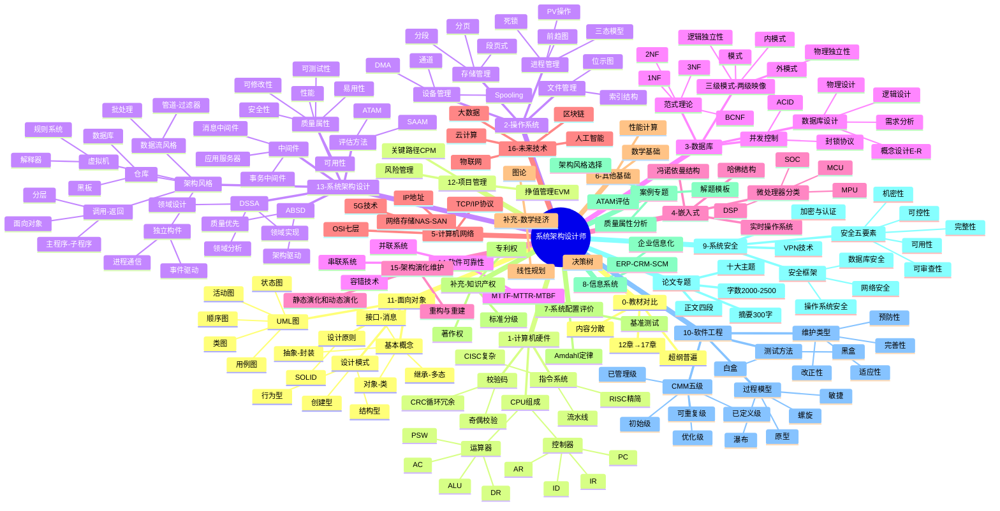
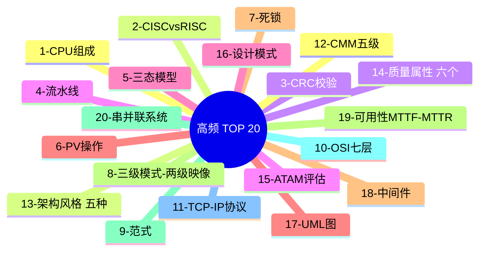
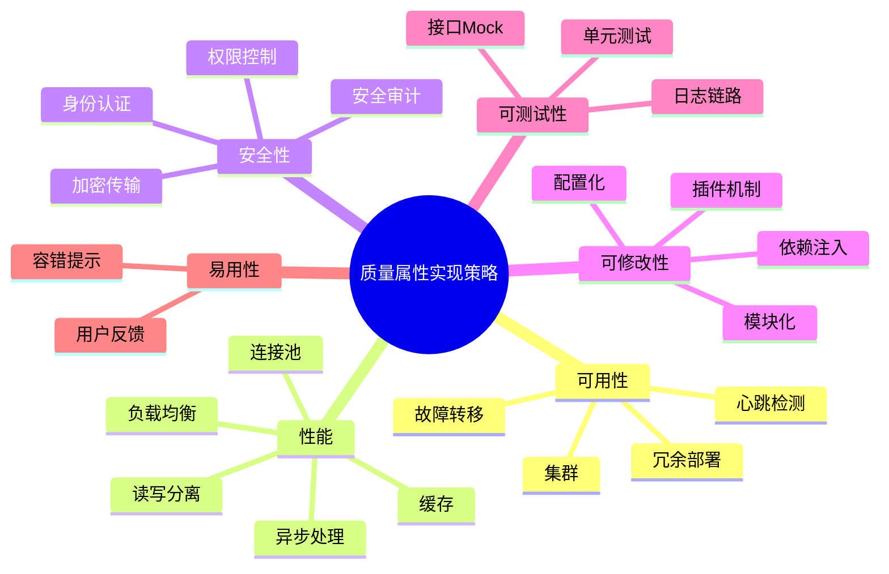
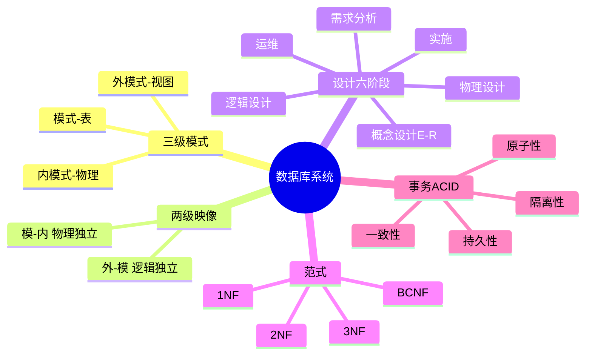

# 软考系统架构设计师 — Mermaid 思维导图专版

> 本文件包含纯 Mermaid mindmap 代码块，可直接在 Markdown 预览或 VS Code (Markmap 扩展) 渲染。

---

---

## 章节分脑图

---

## 质量属性场景设计

---

## 数据库设计

---

*生成时间：2026-05-12*
*格式：Mermaid mindmap*
*可在 VS Code 通过 Markmap 扩展或内置 Mermaid 预览渲染*
