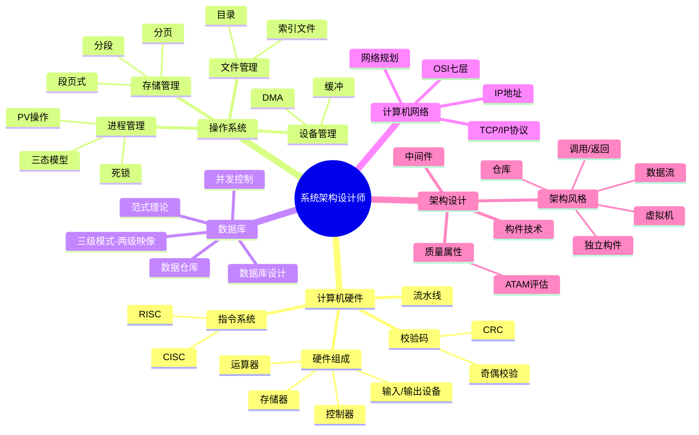

# 系统架构设计师 思维导图 (Markmap)

---

## 1. 计算机硬件 (0-3分)

### 考情分析
- 历年分值：19-21年未考，22年考磁盘调度
- 考查频次：低频

### 计算机硬件组成
#### 五大部件
- 运算器
- 控制器
- 存储器（内存/外存）
- 输入设备
- 输出设备
#### CPU = 运算器 + 控制器（中央处理单元）
- CPU 功能：程序控制、操作控制、时间控制、数据处理
- 运算器组成
  - ALU（算术逻辑单元）
  - AC（累加寄存器）
  - DR（数据缓冲寄存器）
  - PSW（状态条件寄存器）
- 控制器组成
  - IR（指令寄存器）
  - PC（程序计数器）
  - AR（地址寄存器）
  - ID（指令译码器）

### 校验码
#### 码距
- 定义：A→B 需改变的位数
- 码距越大，纠错检错能力越强
#### 奇偶校验码
- 增加1位校验位使1的个数为奇/偶
- 只能检1位错，无法纠错
#### CRC 循环冗余校验码
- 只能检错，不能纠错
- 需约定生成多项式 G(x)
- 模2除法求余数
- 余数为0代表无错

### 指令系统
#### 指令组成
- 操作码 + 操作数（地址码）
#### 执行过程
- 取指令 → 分析指令 → 执行指令
#### 寻址方式
##### 指令寻址
- 顺序寻址
- 跳跃寻址
##### 操作数寻址
- 立即寻址
- 直接寻址
- 间接寻址
- 寄存器寻址
- 基址寻址（扩大寻址能力）
- 变址寻址
#### CISC vs RISC
- CISC：复杂指令，微程序实现，可变长格式
- RISC：精简指令，硬布线逻辑，定长/单周期，仅 Load/Store 访存
#### 指令流水线
- 取指 → 分析 → 执行 叠加
- 超流水线：细化流水+增加级数+提高主频，以时间换空间

### 存储系统
#### 层次结构
- 寄存器 → Cache → 主存 → 外存
#### 磁盘调度
- 22年真题考查点

### 输入/输出技术
- 程序控制方式
- 中断方式
- DMA 方式

### 总线结构
- 内部总线
- 系统总线
- 外部总线

---

## 2. 操作系统知识 (3-5分)

### 考情分析
- 历年分值：每年 3-5 分
- 考查频次：高频
- 第二版教材描述太少，仍需掌握原有内容

### 操作系统概述
#### 定义
- 管理软/硬件资源，控制程序执行，提供用户接口
#### 四大特征
- 并发性、共享性、虚拟性、不确定性
#### 主要功能
- 进程管理（CPU 时间分配）
- 文件管理（存储空间/目录/读写/存取控制）
- 存储管理（分配回收/保护/地址映射/扩充）
- 设备管理（分配/启动/完成/回收）
- 作业管理（任务/界面/交互）
#### 分类
- 批处理操作系统（单道/多道）
- 分时操作系统（时间片轮转）
- 实时操作系统（快速响应，可靠性高）
- 网络操作系统（集中/CS/对等）
- 分布式操作系统（无主次，通信交换）
- 微型计算机操作系统（Windows/MacOS/Linux）
#### 嵌入式操作系统特点
- 微型化、可定制、实时性、可靠性、易移植性
- 初始化：片级→板级→系统级

### 进程管理
#### 进程组成
- PCB（唯一标志）+ 程序 + 数据
#### 三态模型
- 运行 ↔ 就绪（时间片到/被调度）
- 运行 → 阻塞（等待事件）
- 阻塞 → 就绪（事件发生）
#### 前趋图
- 表示任务并行/顺序关系
#### 进程资源图
- 阻塞节点：请求资源已全部分配
- 非阻塞节点：请求资源有剩余
- 全部阻塞 → 死锁
#### 进程同步与互斥
- 临界资源：需互斥访问
- 临界区：操作临界资源的程序段
- 互斥：同一时间只能一个任务使用（如打印机）
- 同步：多任务并发，速度差异（如车和自行车）
- P/V 操作（信号量）
  - P：S=S-1，S<0 则阻塞
  - V：S=S+1，S≤0 则唤醒
- 经典问题：生产者-消费者
  - S0：互斥信号量（仓库独占）
  - S1：同步信号量（仓库空闲数）
  - S2：同步信号量（商品数）
#### 进程调度
- 先来先服务
- 时间片轮转
- 优先级调度
#### 死锁
- 必要条件：互斥/保持等待/不可剥夺/循环等待

### 存储管理
#### 分区存储管理
#### 分页存储管理
- 逻辑地址 = 页号 + 页内偏移
#### 分段存储管理
- 逻辑地址 = 段号 + 段内偏移
#### 段页式存储管理
#### 页面置换算法
- 最佳置换 OPT
- 先进先出 FIFO
- 最近最少使用 LRU

### 文件管理
#### 文件目录
- 树形目录结构
#### 索引文件结构
- 直接索引/一级间接/二级间接
#### 文件存储空间管理
- 空闲表法/空闲链表法/位示图法

### 设备管理
#### I/O 软件
- 中断处理程序
- 设备驱动程序
- 设备独立性软件
- 用户层 I/O
#### 设备管理技术
- 通道技术
- DMA 技术
- 缓冲技术
- Spooling 技术

### 死锁
#### 处理策略
- 预防（打破四个必要条件）
- 避免（银行家算法）
- 检测与解除

---

## 3. 数据库系统 (3-5分)

### 考情分析
- 历年分值：每年 3-5 分
- 考查频次：高频
- 第二版考点无变化，NoSQL 在案例专题

### 基本概念
#### 数据
- 数据库中存储的基本对象，描述事物的符号记录
#### 数据库 DB
- 长期存储、有组织、可共享、大量数据的集合
- 特征：按数据模型组织、共享、冗余度小、独立性高、易扩展
#### 数据库系统 DBS
- 组成：数据库 + 硬件 + 软件 + 人员（DBA等）
#### 数据库管理系统 DBMS
- 功能：数据定义、操作、运行管理、存储管理、建立维护

### 三级模式-两级映像
#### 三级模式
- 内模式：物理存储文件
- 模式（概念模式）：基本表
- 外模式：视图
#### 两级映像
- 外模式-模式映像：表↔视图映射（逻辑独立性）
- 模式-内模式映像：表↔存储映射（物理独立性）

### 数据模型
#### 分类
- 关系模型（二维表）
- 概念模型（E-R 图，用户视角）
- 网状模型
- 面向对象模型（类+继承）
#### 三要素
- 数据结构、数据操作、完整性约束

### 数据库设计（六阶段）
#### 需求分析
- 产出：数据流图、数据字典、需求说明书
#### 概念结构设计
- 设计 E-R 图
- 冲突类型：属性冲突、命名冲突、结构冲突
#### 逻辑结构设计
- E-R 图 → 关系模式
#### 物理设计
- 数据分布、存储结构、访问方式
#### 实施阶段
#### 运行维护阶段

### 关系模型
#### 函数依赖
- 完全/部分/传递函数依赖
#### 键与约束
- 候选键/主键/外键
- 实体完整性/参照完整性/用户定义完整性
#### 范式
- 1NF：属性不可分
- 2NF：消除部分依赖
- 3NF：消除传递依赖
- BCNF：主属性对候选码完全依赖
#### 模式分解
- 保持函数依赖
- 无损连接
#### 关系代数
- 选择/投影/连接/除

### SQL 语言
- DDL / DML / DCL

### 并发控制
#### 封锁协议
- 一级封锁（防止丢失修改）
- 二级封锁（防止读脏数据）
- 三级封锁（防止不可重复读）
#### 事务 ACID
- 原子性/一致性/隔离性/持久性

### 数据库安全
- 用户认证/存取控制/视图/审计/备份恢复

### 分布式数据库
- 分片透明/复制透明/位置透明

### 数据仓库
- 主题导向/集成/稳定/时变
- OLAP vs OLTP

### 反规范化技术
- 增加冗余/派生列/表合并

### 数据库新技术
- NoSQL / 大数据

---

## 4. 计算机网络 (3-5分)

### 考情分析
- 分值：每年 3-5 分
- 超纲率 50%，第二版教材未覆盖超纲内容

### 网络功能和分类
#### 功能
- 数据通信、资源共享、集中管理、分布式处理、负载均衡
#### 性能指标
- 速率、带宽、吞吐量、时延、往返时间、利用率
#### 按分布范围
- LAN（局域网）：4Mbps~1Gbps
- MAN（城域网）：50Kbps~100Mbps
- WAN（广域网）：9.6Kbps~45Mbps
#### 拓扑结构
- 总线型（利用率低/干扰大/价格低）
- 星型（交换机+中央单元负荷大）
- 环型（方向固定/效率低）
- 树型（总线扩充/分级）
- 分布式（任意连接/管理难）

### OSI 七层模型
- 物理层→数据链路层→网络层→传输层→会话层→表示层→应用层

### TCP/IP 协议族
#### 应用层
- HTTP/FTP/DNS/SMTP/POP3/SNMP
#### 传输层
- TCP（面向连接可靠）
- UDP（无连接不可靠）
#### 网络层
- IP/ICMP/ARP/RARP/IGMP
#### 网络接口层

### 通信方式和交换方式
#### 通信技术
- 信道：物理信道+逻辑信道
- 复用技术：TDM / FDM / CDM
- 多址技术：TDMA / FDMA / CDMA
#### 5G 特征
- OFDM 优化波形
- 大规模 MIMO（最多 256 天线）
- 毫米波（>24GHz）
- 服务化架构+网络切片

### IP 地址
- IPv4：分类编址/子网划分/CIDR
- IPv6：128 位，简化报头

### 网络规划和设计
- 分层设计：核心层/汇聚层/接入层

### 网络存储技术
- DAS / NAS / SAN

---

## 13. 系统架构设计 (~20分)

### 考情分析
- 分值：每年约 20 分（含案例+论文）
- 考查频次：最高频
- 对应第二版教材第 7、8 章

### 软件架构概述
#### 定义
- 从需求分析到软件设计的过渡过程
- 需求分配：将满足需求的职责分配到组件上
#### 组成
- 构件描述 + 构件相互作用（连接件）+ 集成模式 + 约束
#### 作用
- 项目干系人交流手段
- 对系统实现的约束条件
- 决定开发和维护组织结构
- 制约系统质量属性
- 可传递和可复用的模型

### 软件架构风格
#### 数据流风格
- 批处理
- 管道-过滤器
#### 调用/返回风格
- 主程序-子程序
- 面向对象
- 分层结构
#### 独立构件风格
- 进程通信
- 事件驱动（隐式调用）
#### 虚拟机风格
- 解释器
- 规则系统
#### 仓库风格
- 数据库系统
- 黑板系统

### 软件架构设计与生命周期
#### 需求分析阶段
- 问题空间 → 解空间
#### 设计阶段
- SA 模型描述/分析/设计经验复用
- 三个层次：基本概念（构件+连接子）/ ADL / 多视图
#### 实现阶段
- 基于 SA 的开发过程支持
- SA → 实现过渡
- 基于 SA 的测试技术
#### 构件组装阶段
- 可复用构件互联
- 体系结构失配检测
  - 构件引起
  - 连接子引起
  - 全局假设冲突
#### 部署阶段
- 高层体系结构视图描述软硬件模型
- 分析部署方案质量属性
#### 后开发阶段
- 动态软件体系结构（运行时变化）
- 体系结构恢复与重建（4 类方法）

### 构件技术
#### 构件定义
- 独立可交付的功能单元
- 通过接口提供服务
#### 连接件
- 构件之间的交互机制

### 中间件技术
- 消息中间件
- 事务中间件
- 应用服务器中间件

### 软件架构复用
- 机会复用
- 系统复用

### DSSA（领域特定软件架构）
- 领域分析 → 领域设计 → 领域实现
- 三要素：领域模型/参考需求/参考架构

### ABSD（基于架构的软件设计）
- 架构驱动
- 质量属性优先

### 质量属性
- 可用性/性能/安全性/可修改性/可测试性/易用性
#### 场景描述
- 刺激源/刺激/环境/制品/响应/响应度量

### 架构评估
#### 评估方法
- ATAM（架构权衡分析方法）
- SAAM（场景架构分析方法）
#### 质量属性效用树
- 优先级划分

---

## 高频考点 TOP 思维导图

### 计算机硬件
- CPU 组成与功能
- CISC vs RISC 对比
- 校验码（奇偶/CRC）
- 流水线技术

### 操作系统
- 进程三态转换
- PV 操作 + 生产者-消费者
- 死锁条件与处理
- 页面置换算法
- 文件索引结构

### 数据库
- 三级模式-两级映像
- 范式（1NF/2NF/3NF/BCNF）
- E-R 图与数据库设计
- 事务 ACID 与封锁

### 计算机网络
- OSI 七层模型
- TCP/IP 协议族
- IP 地址与子网划分

### 系统架构设计
- 架构风格分类
- 质量属性场景
- ATAM 评估方法
- 构件与连接件
- 中间件技术

---

### Mermaid Mindmap 示例

---
*生成时间：2026-05-12*
*素材来源：复习笔记各章节*
*格式：Markmap / Mermaid*
