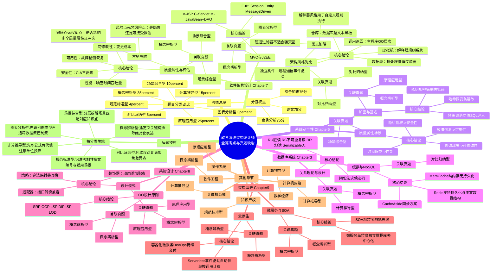

```markdown
# 软考系统架构设计师 · 真题深度解析与考点思维导图

## 全篇考点热力图与备考导航

### 全局考情总览
- **综合知识（75分）**
  - 计算机系统基础：约10分
  - 操作系统：约8分
  - 数据库系统：约8分
  - 计算机网络：约8分
  - 系统安全性：约8分
  - 软件工程：约12分
  - 软件架构设计：约18分
  - 系统设计：约15分
  - 架构演进：约15分
  - 知识产权：约5分
  - 数学与经济管理：约5分
  - 专业英语：约5分
- **案例分析（75分）**
  - 必做题：软件架构设计（质量属性+架构评估/风格）
  - 选做2题：系统开发基础 / 数据库系统 / Web应用 / 嵌入式系统
- **论文（75分）**
  - 四选一，架构设计类（架构风格、SOA、微服务、云原生等）占比超70%

### 题目分类全局统计
- **概念辨析型**：约35%（架构风格定义、质量属性分类、UML图辨析、设计模式特点、范式判定）
- **原理应用型**：约25%（PV操作应用、加密签名原理、缓存同步策略、架构战术选择）
- **计算推导型**：约15%（流水线、Cache映射、子网划分、可靠性计算、投资回收期）
- **场景综合型**：约10%（案例分析主体：质量属性识别、架构选型、改造方案设计）
- **对比归纳型**：约8%（架构风格对比、Redis vs MemCache、SOA vs 微服务、C/S vs B/S）
- **规范标准型**：约4%（著作权期限、专利期限、国家标准代号）
- **图表分析型**：约3%（数据流图填空、UML图识别、架构图组件填空）

### 高频错题 TOP 20 双维度交叉
#### 概念混淆类（概念辨析型陷阱）
- **敏感点 vs 权衡点 vs 风险点**：权衡点影响多个质量属性且属性间冲突；敏感点只影响一个；风险点是潜在隐患
- **可用性 vs 可靠性**：可用性强调正常运行时间比例（故障间隔/恢复速度）；可靠性强调在规定条件下无故障运行的能力
- **RISC vs CISC**：RISC指令长度固定、种类少、硬布线；CISC指令长度可变、种类多、微程序控制
- **主键 vs 候选码**：候选码是最小超键；主键是从候选码中选定的一个
#### 计算失误类（计算推导型陷阱）
- **流水线吞吐率**：最大吞吐率 = 1 / 瓶颈段时间（不是平均段）
- **子网可用主机数**：2^n - 2（必须减去网络地址和广播地址）
- **可靠性串联/并联**：串联 R=R1×R2；并联 R=1-(1-R1)×(1-R2)
- **静态投资回收期**：= 初始投资 / 每年净收益（不考虑折现）
#### 审题偏差类
- 题干问"不正确的是"误选正确项
- 混淆"可以"与"必须"、"只能"等绝对化表述
- 忽略新教材已删除提示（如部分旧版网络协议细节）

### 跨章节综合真题归纳
- **架构风格 + 质量属性 + 设计模式**（场景综合型/对比归纳型）
  - 管道-过滤器风格 → 支持可修改性/性能 → 结合策略模式实现算法替换
- **性能优化 + 数据库 + 缓存**（场景综合型）
  - 读写分离 → 反规范化技术 → Redis/MemCache缓存 → 缓存一致性方案
- **安全架构 + 网络通信 + 法律法规**（规范标准型/原理应用型）
  - SSL/TLS传输加密 + 数字证书（PKI）+ 软件著作权保护期

---

## 第7章 软件架构设计（分值：18-25分 · 高频）

### 考情分支
- **历年分值**：综合知识约18分，案例分析必考1题（25分），论文高频
- **考查频次**：极高频，每年必考
- **题型分布**：单选（概念辨析+对比归纳）、案例（场景综合+图表分析）、论文（场景综合）
- **题目分类占比**：概念辨析型 40% | 对比归纳型 25% | 场景综合型 25% | 图表分析型 10%

### 核心考点图谱
#### 质量属性与架构评估（出现10+次）
- **真题年份分布**
  - 2022-11 案例1（质量属性效用树填空）[场景综合型]
  - 2020-11 案例1（质量属性场景识别）[场景综合型]
  - 2017-11 案例1（效用树、风险点/敏感点/权衡点）[概念辨析型]
  - 2015-11 案例1（效用树、风险点/敏感点/权衡点）[概念辨析型]
  - 2011-11 案例1（效用树）[场景综合型]
- **高频陷阱**
  - 陷阱1：将"可修改性"误判为"可用性"——注意题干关键词是"修改工作量"还是"故障恢复"
  - 陷阱2：混淆敏感点与权衡点——敏感点只影响一个质量属性；权衡点影响多个且相互冲突
  - 陷阱3：风险点不是非风险点——风险点是潜在隐患；非风险点是可接受的做法
- **必背要点**
  - 性能：响应时间、吞吐量；策略：优先级队列、增加计算资源、并发机制
  - 可用性：故障间隔时间；策略：心跳、Ping/Echo、冗余、选举
  - 安全性：机密性、完整性、不可抵赖性；策略：入侵检测、认证授权、追踪审计
  - 可修改性：变更代价；策略：接口-实现分离、信息隐藏

#### 架构风格对比与选择（出现8+次）
- **真题年份分布**
  - 2022-11 案例1（架构风格对比）[对比归纳型]
  - 2020-11 案例1（架构风格选取）[对比归纳型]
  - 2017-11 案例2（MVC、EJB、J2EE）[概念辨析型]
  - 2014-11 案例1（MVC、扩展接口模式）[对比归纳型]
  - 2012-11 案例1（架构风格对比与选取）[对比归纳型]
- **高频陷阱**
  - 陷阱1：管道-过滤器不适合强交互场景——它适合数据流处理，交互式数据处理支持弱
  - 陷阱2：解释器风格与规则系统风格混淆——解释器解释自定义语法；规则系统基于规则集和推理引擎
  - 陷阱3：隐式调用（事件驱动）中生产者必须知道消费者——错误，事件驱动完全解耦，生产者不需要知道消费者
- **必背要点**
  - 数据流：批处理（整体为单位）、管道-过滤器（前一个输出是后一个输入）
  - 调用/返回：主程序/子程序、面向对象、层次结构（最多影响上下两层）
  - 独立构件：进程通信（同步/异步）、事件驱动（隐式调用，如语法高亮）
  - 虚拟机：解释器（自定义规则，如JVM）、规则系统（DSS/专家系统）
  - 仓库：数据库（现代编译器IDE）、超文本（互联网）、黑板（语音识别/知识推理）
  - C2风格：构件+连接件，顶部底部规则

#### MVC与J2EE架构（出现5+次）
- **真题年份分布**
  - 2021-11 案例1（MVC组件填空）[图表分析型]
  - 2017-11 案例2（MVC、EJB）[概念辨析型]
  - 2013-11 案例4（MVC架构）[概念辨析型]
- **高频陷阱**
  - 陷阱1：Servlet属于视图——错误，Servlet是控制器；JSP是视图
  - 陷阱2：EJB的Entity Bean用于维护会话——错误，Session Bean维护会话；Entity Bean维护持久数据
- **必背要点**
  - Model：封装应用状态、业务数据与逻辑
  - View：显示数据、接收输入，不做业务处理
  - Controller：解释输入、调用模型、选择视图
  - J2EE四层：客户层、Web层（JSP/Servlet）、业务层（EJB/Service）、信息系统层（DAO/Database）
  - EJB三种Bean：Session Bean（会话）、Entity Bean（持久数据）、Message-Driven Bean（异步消息）

---

### 📝 真题解析库（第7章）

#### 【2022-11 案例1】质量属性效用树与架构评估
**考点定位：** 软件架构设计 → 架构评估 → 质量属性效用树 / 风险点 / 敏感点 / 权衡点  
**难度：** ⭐⭐⭐  
**题型：** 案例分析  
**题目分类：** 场景综合型  

**题干核心描述：**  
某电子商务公司升级在线交易系统，给出架构设计评估会议中用户提出的需求、架构师识别的关键质量属性场景和评估专家的意见（a-m共13条描述），要求完成效用树填空，并识别风险点、敏感点、权衡点。

**选项/填空分析：**
本题为主观填空题，以下对题干关键描述进行归类解析：

- **a. 正常负载下，系统必须在0.5秒内响应用户的交易请求** ✅ → 性能（响应时间）
- **b. 用户的信用卡支付必须保证99.999%的安全性** ✅ → 安全性（安全级别）
- **c. 系统升级后用户名要求至少包含8个字符** ❌ → 属于功能需求/约束，非质量属性场景（干扰项）
- **d. 网络失效后，系统需要在2分钟内发现错误并启用备用系统** ✅ → 可用性（故障检测与恢复）
- **e. 高峰负载下，用户发起支付请求后系统必须在10秒内完成支付功能** ✅ → 性能（吞吐量/响应时间）
- **f. 系统拟采用新的加密算法，这会提高系统安全性，但同时会降低系统的性能** ✅ → **权衡点**（安全性与性能冲突）
- **g. 对交易请求处理时间的要求将影响系统数据传输协议和交易处理过程的设计** ✅ → **敏感点**（影响性能这一单一质量属性）
- **h. 需要在30人月内为系统添加公司新购买的事务处理中间件** ✅ → 可修改性（修改代价）
- **i. 现有架构设计中的支付部分与第三方支付平台紧耦合，当支持新支付平台时会导致支付部分代码修改，影响可修改性** ✅ → **风险点**（潜在隐患：紧耦合导致可修改性下降）
- **j. 主站点断电后，需要在3秒内将访问请求重定向到备用站点** ✅ → 可用性（故障恢复速度）
- **k. 用户信息数据库授权必须保证99.999%可用** ✅ → 可用性
- **l. 系统需要对Web界面风格进行修改，修改工作必须在4人月内完成** ✅ → 可修改性
- **m. 系统需要为后端工程师提供远程调试接口，并支持远程调试** ✅ → 可测试性

**解题思路：**  
1. 识别题干关键词 → 定位考点为"质量属性效用树" → 判定题目分类为场景综合型  
2. 回忆效用树的四个根节点：性能、可用性、安全性、可修改性（有时包括可测试性）  
3. 逐条分析描述的倾向性：  
   - 出现"响应时间、吞吐量、负载"→ 性能  
   - 出现"故障、恢复、重定向、可用百分比"→ 可用性  
   - 出现"加密、授权、安全"→ 安全性  
   - 出现"修改、添加、人月、代价"→ 可修改性  
4. 识别架构评估三要素：  
   - 风险点：架构设计中**潜在的、存在问题**的决策隐患（如紧耦合）  
   - 敏感点：为实现某质量属性，一个或多个构件具有的特性（如g只影响性能）  
   - 权衡点：影响**多个**质量属性的特性，是多个质量属性的敏感点（如f同时影响安全性和性能）

**知识延伸：**  
- 关联知识点：ATAM评估方法、架构战术（Tactic）  
- 教材对应：第二版第7章（软件架构设计）  
- 同类真题：2017-11案例1、2015-11案例1、2011-11案例1

---

#### 【2018-11 案例1】非功能性需求分类与C/S架构选择
**考点定位：** 软件架构设计 → 非功能性需求 → 操作性/性能/安全性/文化需求分类  
**难度：** ⭐⭐⭐  
**题型：** 案例分析  
**题目分类：** 概念辨析型 + 场景综合型  

**题干核心描述：**  
某文化用品商城系统需求(a-h)，要求将需求填入操作性、性能、安全性、文化需求四类；并分析瘦客户端C/S架构能满足哪些需求。

**需求归类解析：**
- **a. 用户界面支持用户的个性化定制** → 操作性需求（与用户操作使用相关）
- **b. 系统需要支持当前主流的标准和服务，特别是通信协议和平台接口** → 操作性需求
- **c. 用户操作的响应时间应不大于3秒，竞拍板块不大于1秒** → 性能需求（响应时间）
- **d. 系统具有故障诊断和快速恢复能力** → 性能需求（教材归类：可靠性/可用性在案例中有时被归入性能大类，或单独列出；此处根据答案归入性能）
- **e. 用户密码需要加密传输** → 安全性需求
- **f. 系统需要支持不低于2G的数据缓存** → 性能需求（资源利用）
- **g. 用户操作停滞时间超过一定时限需要重新登录验证** → 安全性需求
- **h. 系统支持用户选择汉语、英语或法语三种语言之一进行操作** → 文化需求（文化背景因素）

**瘦客户端C/S满足的需求分析：**
- **a. 个性化定制** ✅：瘦客户端将业务逻辑放在服务端，易于统一推送和定制界面
- **b. 支持主流标准** ⚠️：胖瘦客户端差异不大
- **c. 响应时间** ✅：服务端可用集群支持，瘦客户端依靠服务端计算能力
- **d. 故障诊断和恢复** ✅：瘦客户端故障只需修复服务端，胖客户端需更新所有客户端
- **e. 密码加密传输** ✅：瘦客户端C/S可以端到端加密；胖客户端后端直连数据库，加密传输基础弱
- **f. 2G数据缓存** ❌：这是瘦客户端的劣势，胖客户端本地缓存更容易实现大容量缓存
- **g. 重新登录验证** ⚠️：两者均可实现
- **h. 多语言** ⚠️：两者均可实现

**解题思路：**  
1. 识别考点为"非功能性需求分类" → 概念辨析型  
2. 四类需求的定义关键词：  
   - 操作性：用户如何使用、界面、操作习惯、标准协议  
   - 性能：响应时间、吞吐量、准确性、有效性、资源利用率、可靠性、可用性  
   - 安全性：合法用户服务、阻止非授权用户、加密、认证  
   - 文化：语言、习俗、文化背景  
3. 瘦客户端 vs 胖客户端的核心差异：业务逻辑存放位置（服务端 vs 客户端）→ 引出维护性、缓存能力、计算能力差异

**知识延伸：**  
- 关联知识点：质量属性场景六大要素（刺激源、刺激、环境、制品、响应、响应度量）  
- 教材对应：第二版第7章  
- 同类真题：2020-11案例1（非功能性需求）

---

#### 【2017-11 案例1】架构风格选择：管道-过滤器 vs 数据存储为中心
**考点定位：** 软件架构设计 → 架构风格 → 管道-过滤器 vs 仓库/数据存储为中心  
**难度：** ⭐⭐⭐⭐  
**题型：** 案例分析  
**题目分类：** 对比归纳型 + 场景综合型  

**题干核心描述：**  
某字处理软件脚本语言集成开发环境，核心需求：
1. 提供编辑、语法检查、解释、执行、调试等功能，并支持灵活组合、配置与替换
2. 提供可视化编程界面，拖拽和代码填充完成核心业务流程编写
3. 调试时实现代码自动定位（响应断点命中事件，自动跳转到对应代码）

王工认为应采用管道-过滤器，李工认为应采用数据存储为中心，最终采用李工方案。

**对比分析：**
- **交互方式**
  - 管道-过滤器：支持有限，数据流单向，不适合强交互式数据处理
  - 数据存储为中心：支持交互式数据处理，数据统一存储，组件围绕数据操作 ✅
- **扩展性（功能灵活组合、配置与替换）**
  - 管道-过滤器：数据格式解耦，但处理逻辑关系灵活定义方面较差
  - 数据存储为中心：以数据格式解耦功能依赖，可灵活定义功能逻辑顺序 ✅
- **数据管理（多种数据类型、格式转换）**
  - 管道-过滤器：只能支持有限度的数据格式，格式转换灵活性差
  - 数据存储为中心：中心存储器表示多种数据格式，支持格式转换 ✅

**需求（2）和（3）的架构风格选择：**
- **需求（2）可视化编程、拖拽填充** → **解释器架构风格**  
  需要定义可视化元素的语言/规则，通过解释器解释执行，生成脚本代码。
- **需求（3）断点命中自动定位** → **隐式调用（事件驱动）架构风格**  
  定义"断点命中"事件，注册事件处理器（屏幕定位函数），调试器监听事件并触发定位。

**解题思路：**  
1. 识别考点为"架构风格对比与选择" → 对比归纳型  
2. 从三个维度（交互、扩展、数据管理）对比两种风格  
3. 针对具体需求选择风格：  
   - 需要解释自定义规则 → 解释器（虚拟机风格）  
   - 需要事件触发、断点响应 → 隐式调用（事件驱动）

**知识延伸：**  
- 关联知识点：解释器风格组成（解释器引擎、存储区、数据结构）；事件驱动组成（事件源、事件注册表、事件处理器）  
- 教材对应：第二版第7章（架构风格）  
- 同类真题：2012-11案例1（架构风格对比）

---

#### 【2021-11 案例1】MVC架构与J2EE组件填空
**考点定位：** 软件架构设计 → MVC模式 / J2EE四层结构 / EJB组件类型  
**难度：** ⭐⭐⭐  
**题型：** 案例分析  
**题目分类：** 图表分析型 + 概念辨析型  

**题干核心描述：**  
基于JavaEE的MVC模式设计资源共享平台，图2-1架构图中填空（1）-（5）；EJB构件中Bean的三种类型及职责；判断有状态和无状态构件。

**架构图填空解析：**
- **（1）JSP** → View（视图）：负责显示、收集数据
- **（2）Servlet** → Controller（控制器）：处理业务逻辑、验证数据、调用Service、实例化JavaBean
- **（3）Service** → 业务层服务：处理复杂业务逻辑
- **（4）JavaBean** → Model的一部分：数据封装，在Servlet与JSP间传递
- **（5）DAO** → Model的一部分：连接数据库，进行CRUD操作
- **流程**：JSP发数据 → Servlet解析 → 调用Service → DAO操作数据库 → JavaBean封装 → 返回Servlet → 返回JSP

**EJB三种Bean类型：**
- **Session Bean（会话Bean）**：维护短暂会话，处理业务逻辑；分为有状态（Stateful）和无状态（Stateless）
- **Entity Bean（实体Bean）**：维护一行持久稳固的数据（持久化层）
- **Message-Driven Bean（消息驱动Bean）**：异步接受消息，处理JMS消息

**有状态 vs 无状态判断：**
- **有状态（Stateful）**：需要保存客户端会话状态，如身份认证（a）、资源发布（b）、在线编辑（d）
- **无状态（Stateless）**：不保存会话状态，每次调用独立，如资源检索（c）、统计分析（e）

**解题思路：**  
1. 识别图为"MVC+J2EE分层架构图" → 图表分析型  
2. 牢记MVC各职责及J2EE各层组件映射  
3. 有状态/无状态判断关键：是否需要记住上次调用的状态信息

**知识延伸：**  
- 关联知识点：JSP+Servlet+JavaBean+DAO经典MVC实现；EJB3.0后Entity Bean被JPA替代  
- 教材对应：第二版第7章  
- 同类真题：2017-11案例2（MVC、EJB、J2EE）

---

#### 【2020-11 综合知识】MVC模式中的核心组件
**考点定位：** 软件架构设计 → MVC设计模式  
**难度：** ⭐  
**题型：** 综合知识（单选）  
**题目分类：** 概念辨析型  

**选项分析：**
- **A. Model(模型)** ✅  
  解析：MVC三大核心组件之一。
- **B. View(视图)** ✅  
  解析：MVC三大核心组件之一。
- **C. Controller(控制器)** ✅  
  解析：MVC三大核心组件之一。
- **D. Service(服务)** ❌  
  解析：Service是三层架构（表现层/业务层/数据层）中的业务层组件，不是MVC的核心组件。MVC中的业务逻辑通常由Model承担，Controller负责调度。

**正确答案：D**

**解题思路：**  
1. 识别题干关键词"MVC三个核心组件" → 概念辨析型  
2. 排除非核心组件Service（属于分层架构扩展概念）

**知识延伸：**  
- 关联知识点：MVP、MVVM与MVC的区别  
- 教材对应：第二版第7章

---

## 第5章 系统安全性与质量属性（分值：8-15分 · 中高频）

### 考情分支
- **历年分值**：综合知识约8分，案例分析穿插考查（质量属性必考）
- **考查频次**：中高频
- **题型分布**：单选（概念辨析+原理应用）、案例（场景综合）
- **题目分类占比**：概念辨析型 45% | 场景综合型 30% | 原理应用型 20% | 对比归纳型 5%

### 核心考点图谱
#### 质量属性场景识别（出现10+次）
- **真题年份分布**
  - 2022-11 案例1（a-m质量属性归类）[场景综合型]
  - 2020-11 案例1（非功能性需求分类）[场景综合型]
  - 2021-11 综合（性能vs可用性等判断）[概念辨析型]
  - 2020-11 综合（性能判断）[概念辨析型]
- **高频陷阱**
  - 陷阱1：将"故障恢复时间"归为性能——应属于可用性
  - 陷阱2：将"修改界面人月数"归为可用性——应属于可修改性
  - 陷阱3：将"支持远程调试"归为可用性——应属于可测试性
- **必背要点**
  - 性能：响应时间、吞吐量、负载、资源利用率
  - 可用性：故障检测时间、恢复时间、重定向时间、正常运行时间比例
  - 安全性：加密、认证、授权、隐私保护、不可否认
  - 可修改性：修改时间、修改成本、扩展能力、部署新功能时间
  - 可测试性：提供调试接口、日志记录、故障定位能力

#### 加密与数字签名（出现6+次）
- **真题年份分布**
  - 2025上 综合（数字签名原理）[原理应用型]
  - 2020下 综合（非对称加密算法选择）[概念辨析型]
  - 2021下 综合（防火墙功能）[概念辨析型]
  - 2023下 综合（SQL注入防护）[原理应用型]
- **高频陷阱**
  - 陷阱1：数字签名用私钥加密——正确；但加密通信是用公钥加密/私钥解密
  - 陷阱2：认为防火墙可以查杀病毒——防火墙做边界控制，杀毒需要IDS/IPS和防病毒软件
  - 陷阱3：认为所有开源许可证都允许商业使用——错误，GPL有传染性限制，需仔细阅读
- **必背要点**
  - 对称加密：DES、3DES、AES、IDEA；速度快，适合大数据量
  - 非对称加密：RSA、ECC；速度慢，适合密钥交换和数字签名
  - 哈希函数：MD5、SHA；单向性、抗碰撞性
  - 数字签名：哈希生成摘要 + 私钥加密摘要 = 防篡改+防抵赖
  - 数字证书：CA颁发，绑定身份标识与公钥
  - SQL注入防护：预编译语句（PreparedStatement）、参数化查询、输入验证

---

### 📝 真题解析库（第5章）

#### 【2022-11 案例1】质量属性场景识别（a-m）
**考点定位：** 系统安全性 / 软件架构设计 → 质量属性 → 性能、可用性、安全性、可修改性、可测试性、易用性  
**难度：** ⭐⭐⭐  
**题型：** 案例分析  
**题目分类：** 场景综合型  

**题干核心描述：**  
大模型训练平台需求a-l，要求填写对应质量属性。

**逐项解析：**
- **a. 系统发生错误时，异常请求能够不影响用户正常工作，并发送一个消息通知系统管理员** ✅ → **可用性**（故障不影响工作+通知）
- **b. 平台应保护用户隐私，防止未授权访问** ✅ → **安全性**（隐私+授权）
- **c. 系统界面能调整屏幕，适配用户提供的屏幕尺寸比例** ✅ → **易用性**（用户体验/界面适配）
- **d. 用户提交训练任务时应该在一分钟内提供硬件和资源，启动训练** ✅ → **性能**（响应时间/启动时间）
- **e. 支持远程修改，供远程用户进行连接操作，仅提供给系统注册用户使用** ✅ → **安全性**（访问控制）
- **f. 在训练时，应对请求5秒钟提供队列信息** ✅ → **性能**（响应时间）
- **g. 支持多语音界面，操作指南和文档** ✅ → **易用性**（多语言支持/用户体验）
- **h. 发生故障时应在15秒钟内定位故障，解决故障** ✅ → **可用性**（故障定位与恢复）
- **i. 系统发生故障时，要能提供操作日志** ✅ → **可测试性**（支持故障排查）
- **j. 具备扩展能力，能够3天内完成新功能部署** ✅ → **可修改性**（扩展/部署时间）
- **k. 数据库发生故障后，自动切换到备用数据库，保证训练不中断** ✅ → **可用性**（故障转移）
- **l. 符合用户习惯默认的快捷键设置** ✅ → **易用性**（符合用户习惯）

**解题思路：**  
1. 识别考点为"质量属性判断" → 场景综合型  
2. 抓取每条需求的核心动词/名词：  
   - 时间限制（秒/分钟）→ 性能  
   - 故障/错误/中断/恢复/切换 → 可用性  
   - 隐私/加密/未授权/用户注册 → 安全性  
   - 修改/扩展/部署/人月 → 可修改性  
   - 调试/日志/远程连接/接口 → 可测试性  
   - 界面/语言/快捷键/屏幕适配 → 易用性

**知识延伸：**  
- 关联知识点：质量属性场景六要素（刺激源、刺激、环境、制品、响应、响应度量）  
- 教材对应：第二版第7章（质量属性与架构评估）  
- 同类真题：2020-11案例1、2018-11案例1

---

#### 【2025上 综合知识】数字签名原理
**考点定位：** 系统安全性 → 加密技术 → 数字签名  
**难度：** ⭐⭐  
**题型：** 综合知识（单选）  
**题目分类：** 原理应用型  

**选项分析：**
- **A. 防止窃听；防止抵赖** ❌  
  解析：生成消息摘要的目的不是防止窃听（窃听由加密防止），且顺序反了。
- **B. 防止篡改；防止抵赖** ✅  
  解析：哈希生成摘要可检测报文是否被篡改（任何改动导致摘要变化）；用私钥加密摘要可实现不可否认性（只有发送方有私钥）。
- **C. 防止重放；防止窃听** ❌  
  解析：防止重放通常由时间戳或随机数实现，非摘要主要目的。
- **D. 防止抵赖；防止篡改** ❌  
  解析：顺序错误，先生成摘要防篡改，再加密防抵赖。

**正确答案：B**

**解题思路：**  
1. 识别考点"数字签名" → 原理应用型  
2. 明确两个步骤的目的：  
   - 哈希（摘要）：完整性校验 → 防篡改  
   - 私钥加密：身份绑定 → 防抵赖

**知识延伸：**  
- 关联知识点：PKI体系、CA职责、数字证书内容  
- 教材对应：第二版第5章

---

#### 【2023下 综合知识】SQL注入攻击防护
**考点定位：** 系统安全性 → 应用安全 → SQL注入  
**难度：** ⭐⭐  
**题型：** 综合知识（单选）  
**题目分类：** 原理应用型  

**选项分析：**
- **A. SQL注入只能获取数据库信息，不能执行系统命令** ❌  
  解析：严重错误。某些数据库（如SQL Server的xp_cmdshell）利用SQL注入可执行系统命令。
- **B. 使用预编译语句可以有效防止SQL注入** ✅  
  解析：预编译语句（PreparedStatement）将SQL结构与数据分离，攻击者无法注入恶意SQL。
- **C. SQL注入攻击只能通过Web表单提交** ❌  
  解析：SQL注入可通过任何用户输入点发生，包括URL参数、Cookie、HTTP头、JSON数据等。
- **D. 对输入进行简单过滤即可完全防止SQL注入** ❌  
  解析：简单过滤（如替换单引号）容易被绕过（使用编码、注释、不同语法），无法完全防护。

**正确答案：B**

**解题思路：**  
1. 识别考点"SQL注入" → 原理应用型  
2. 牢记根本防护手段：参数化查询/预编译语句 + 输入验证 + 最小权限原则

**知识延伸：**  
- 关联知识点：XSS、CSRF、中间人攻击原理与防护  
- 教材对应：第二版第5章

---

## 第3章 数据库系统（分值：8-15分 · 中高频）

### 考情分支
- **历年分值**：综合知识约8分，案例分析偶尔考查（选做题）
- **考查频次**：中高频
- **题型分布**：单选（计算推导+概念辨析）、案例（对比归纳+场景综合）
- **题目分类占比**：概念辨析型 35% | 计算推导型 30% | 对比归纳型 20% | 原理应用型 15%

### 核心考点图谱
#### 函数依赖与候选码（出现6+次）
- **真题年份分布**
  - 2019下 综合（候选码推导）[计算推导型]
  - 2018下 综合（候选码计算）[计算推导型]
  - 2020下 综合（逻辑结构设计）[概念辨析型]
- **高频陷阱**
  - 陷阱1：将闭包计算遗漏属性——必须确保闭包包含关系全部属性
  - 陷阱2：混淆部分依赖与传递依赖——部分依赖是2NF→3NF的问题；传递依赖是3NF→BCNF的问题
- **必背要点**
  - 候选码：能唯一确定关系中所有属性的最小属性集
  - 求闭包法：从候选属性出发，根据F中的函数依赖逐步推导，直到包含全部属性

#### 缓存与NoSQL对比（出现4+次）
- **真题年份分布**
  - 2022下 案例（Redis vs MemCache）[对比归纳型+场景综合型]
  - 2014下 案例（MemCache与Redis选择）[对比归纳型]
  - 2012下 案例（NoSQL特点）[概念辨析型]
- **高频陷阱**
  - 陷阱1：MemCache支持持久化——错误，MemCache纯内存，重启数据丢失
  - 陷阱2：Redis只能做缓存——错误，Redis支持持久化（RDB/AOF），可作数据库使用
  - 陷阱3：NoSQL完全替代关系数据库——错误，NoSQL适合特定场景（高并发、非结构化），关系数据库适合强事务
- **必背要点**
  - MemCache：纯内存、key-value、不支持持久化、不支持事务、多线程
  - Redis：支持持久化、数据结构丰富（list/set/hash）、支持主从/集群、单线程（IO多路复用）

---

### 📝 真题解析库（第3章）

#### 【2019下 综合知识】候选码推导
**考点定位：** 数据库系统 → 关系数据库理论 → 函数依赖 / 候选码  
**难度：** ⭐⭐⭐  
**题型：** 综合知识（单选）  
**题目分类：** 计算推导型  

**选项分析：**
- **A. A** ✅  
  解析：F={A→BC, B→D, D→E}。A的闭包计算：A→BC，得B、C；B→D，得D；D→E，得E。最终A⁺={A,B,C,D,E}=U。因此A是候选码。
- **B. B** ❌  
  解析：B的闭包：B→D→E，得B,D,E。缺少A、C，不能推出全部属性。
- **C. C** ❌  
  解析：C无函数依赖推出，闭包只有C本身。
- **D. D** ❌  
  解析：D→E，闭包为D,E，无法推出其他属性。

**正确答案：A**

**解题思路：**  
1. 识别考点"候选码" → 计算推导型  
2. 计算各选项属性的闭包：从该属性出发，反复应用函数依赖，直到无法扩展  
3. 若闭包=全部属性U，则为超键；若其真子集闭包≠U，则为候选码

**知识延伸：**  
- 关联知识点：范式判定（1NF→2NF消除部分依赖；2NF→3NF消除传递依赖；3NF→BCNF消除主属性对码的部分/传递依赖）  
- 教材对应：第二版第3章  
- 同类真题：2018下综合、2016下综合

---

#### 【2024上 综合知识】事务隔离级别
**考点定位：** 数据库系统 → 事务处理 → 并发控制 / 隔离级别  
**难度：** ⭐⭐⭐  
**题型：** 综合知识（单选）  
**题目分类：** 概念辨析型  

**选项分析：**
- **A. 在读未提交(Read Uncommitted)级别，可能出现脏读** ✅  
  解析：正确。RU级别允许读取未提交数据，必然出现脏读。
- **B. 在读已提交(Read Committed)级别，可能出现不可重复读** ✅  
  解析：正确。RC级别解决了脏读，但同一事务内两次读取可能因其他事务提交而不同。
- **C. 在可重复读(Repeatable Read)级别，可能出现幻读** ✅  
  解析：正确。RR级别解决了不可重复读，但范围查询时可能出现幻行（InnoDB通过MVCC+间隙锁解决，但标准定义仍存在）。
- **D. 在串行化(Serializable)级别，可能出现幻读** ❌  
  解析：错误。串行化是最严格隔离级别，通过强制事务串行执行，完全避免脏读、不可重复读和幻读。

**正确答案：D**

**解题思路：**  
1. 识别考点"隔离级别与并发问题" → 概念辨析型  
2. 建立映射关系：
   - RU：脏读、不可重复读、幻读 都可能
   - RC：无脏读，有不可重复读、幻读
   - RR：无脏读、无不可重复读，有幻读（理论上）
   - Serializable：全部避免

**知识延伸：**  
- 关联知识点：封锁协议（一级/二级/三级）、两段锁协议、MVCC  
- 教材对应：第二版第3章

---

#### 【2022下 案例】Redis与MemCache对比
**考点定位：** 数据库系统 → 分布式缓存 → Redis vs MemCache  
**难度：** ⭐⭐⭐  
**题型：** 案例分析  
**题目分类：** 对比归纳型 + 场景综合型  

**题干核心描述：**  
某初创企业系统高并发，张工建议重新开发，李工建议用MemCache，刘工建议用Redis。最终采用刘工方案。

**对比表解析（填空）：**
| 维度 | MemCache | Redis |
|------|----------|-------|
| 数据类型 | 简单key-value | key-value, list, set, hash, sorted set |
| 持久性 | 不支持 | 支持（RDB/AOF） |
| 分布式存储 | 客户端哈希 | 主从、Sentinel、Cluster |
| 多线程支持 | 支持 | 单线程（IO多路复用） |
| 内存管理 | 有（Slab分配） | 有 |
| 事务支持 | 不支持 | 有限支持（MULTI/EXEC，非ACID强事务） |

**刘工认为李工方案存在数据可靠性和一致性问题的原因：**
1. **可靠性**：MemCache无持久化功能，掉电后数据全部丢失且无法直接恢复。
2. **一致性**：MemCache不支持事务，操作过程中可能产生数据不一致。

**Redis与关系数据库同步方案：**
- 读取：先读Redis，命中则返回；未命中则读数据库，并同步写入Redis。
- 写入：先写数据库，再同步更新Redis（或采用Cache-Aside模式）。

**Redis分布式存储方案：**
1. **主从复制**：一主多从，读写分离。
2. **Cluster模式**：数据分片，无中心架构。

**Redis集群切片方式：**
1. **客户端切片**：客户端通过key的hash值映射到不同服务器。
2. **数据根据key散列到slot**：不同slot对应不同服务器（Redis Cluster采用16384个slot）。

**解题思路：**  
1. 识别考点"缓存选型与分布式" → 对比归纳型+场景综合型  
2. 从持久化、数据结构、分布式、事务四个维度对比  
3. 可靠性问题核心：MemCache纯内存无持久化  
4. 同步方案核心：旁路缓存（Cache-Aside）模式

**知识延伸：**  
- 关联知识点：缓存穿透、击穿、雪崩及解决方案；分布式事务2PC/TCC/Saga  
- 教材对应：第二版第3章（数据库新技术）  
- 同类真题：2014下案例、2018下案例

---

## 第8章 系统设计（分值：15-20分 · 高频）

### 考情分支
- **历年分值**：综合知识约15分，案例分析穿插考查
- **考查频次**：高频
- **题型分布**：单选（概念辨析+原理应用）、案例（场景综合）
- **题目分类占比**：概念辨析型 40% | 原理应用型 35% | 对比归纳型 20% | 场景综合型 5%

### 核心考点图谱
#### 设计模式分类与应用（出现15+次）
- **真题年份分布**
  - 2020下 综合（策略模式）[原理应用型]
  - 2021下 综合（适配器模式）[原理应用型]
  - 2024上 综合（装饰器模式辨析）[概念辨析型]
  - 2023下 综合（创建型模式判断）[概念辨析型]
  - 2022下 综合（装饰器模式）[原理应用型]
- **高频陷阱**
  - 陷阱1：将适配器模式与代理模式混淆——适配器解决接口不兼容；代理模式控制访问
  - 陷阱2：将装饰器模式与建造者模式混淆——装饰器动态添加职责；建造者构建复杂对象
  - 陷阱3：工厂方法 vs 抽象工厂——工厂方法创建一种产品；抽象工厂创建产品族
- **必背要点**
  - 创建型：单例、工厂方法、抽象工厂、建造者、原型
  - 结构型：适配器、桥接、组合、装饰、外观、享元、代理
  - 行为型：职责链、命令、解释器、迭代器、中介者、备忘录、观察者、状态、策略、模板方法、访问者

#### 面向对象设计原则（出现8+次）
- **真题年份分布**
  - 2022下 综合（依赖倒置原则）[概念辨析型]
  - 2024上 综合（里氏替换原则）[概念辨析型]
  - 2022下 综合（单一职责原则）[概念辨析型]
  - 2019下 综合（开闭原则）[概念辨析型]
- **高频陷阱**
  - 陷阱1：依赖倒置原则要求"高层依赖低层"——错误，应都依赖抽象
  - 陷阱2：里氏替换原则要求"父类替换子类"——错误，是子类替换父类
- **必背要点**
  - SRP：一个类只有一个引起变化的原因
  - OCP：对扩展开放，对修改关闭
  - LSP：子类必须能替换父类
  - DIP：高层模块不应依赖低层模块，二者应依赖抽象
  - ISP：客户端不应依赖它不需要的接口
  - LOD（迪米特法则）：最少知识原则

---

### 📝 真题解析库（第8章）

#### 【2020下 综合知识】策略模式应用
**考点定位：** 系统设计 → 设计模式 → 行为型模式 → 策略模式  
**难度：** ⭐⭐  
**题型：** 综合知识（单选）  
**题目分类：** 原理应用型  

**选项分析：**
- **A. 适配器模式** ❌  
  解析：适配器用于接口不兼容问题的转换，与"多种促销方式灵活替换"场景不符。
- **B. 策略模式** ✅  
  解析：策略模式定义一系列算法（促销策略），分别封装起来，让它们可以互相替换。恰好满足"百分比折扣或现金减免等多种促销方式"且"代码量很大，经常修改"的场景。
- **C. 观察者模式** ❌  
  解析：观察者模式定义对象间一对多依赖，一个对象状态改变通知多个依赖者，不适合促销算法替换。
- **D. 工厂模式** ❌  
  解析：工厂模式关注对象的创建，不关注算法行为的动态替换。

**正确答案：B**

**解题思路：**  
1. 识别场景"多种算法/策略需要灵活替换" → 原理应用型  
2. 策略模式关键词：一系列算法、封装、互相替换、避免多重条件判断

**知识延伸：**  
- 关联知识点：状态模式与策略模式的区别（状态模式状态转换由上下文控制；策略模式由客户端选择）  
- 教材对应：第二版第8章

---

#### 【2021下 综合知识】适配器模式应用
**考点定位：** 系统设计 → 设计模式 → 结构型模式 → 适配器模式  
**难度：** ⭐⭐  
**题型：** 综合知识（单选）  
**题目分类：** 原理应用型  

**选项分析：**
- **A. 适配器模式** ✅  
  解析：系统需要调用不同供应商的税率计算类，但接口不同（不同的调用方法）。适配器模式将一个类的接口转换成客户希望的另一个接口，使原本不兼容的类可以协同工作。
- **B. 代理模式** ❌  
  解析：代理模式控制对对象的访问（如远程代理、保护代理），不解决接口不兼容问题。
- **C. 装饰器模式** ❌  
  解析：装饰器动态添加额外职责，不改变原有接口。
- **D. 外观模式** ❌  
  解析：外观为子系统提供统一高层接口，简化使用；不解决两个已有接口不兼容的问题。

**正确答案：A**

**解题思路：**  
1. 识别关键词"接口不同"、"统一接口调用" → 原理应用型  
2. 适配器模式核心是解决"已有接口不匹配"的问题

**知识延伸：**  
- 关联知识点：桥接模式（抽象与实现分离）与适配器模式（接口转换）的区别  
- 教材对应：第二版第8章

---

#### 【2024上 综合知识】装饰器模式辨析
**考点定位：** 系统设计 → 设计模式 → 结构型模式 → 装饰器模式  
**难度：** ⭐⭐  
**题型：** 综合知识（单选）  
**题目分类：** 概念辨析型  

**选项分析：**
- **A. 单例模式确保一个类只有一个实例** ✅  
  解析：正确，单例模式定义。
- **B. 工厂方法模式将对象的创建延迟到子类** ✅  
  解析：正确，工厂方法让子类决定实例化哪个类。
- **C. 观察者模式定义对象间的一对多依赖关系** ✅  
  解析：正确，观察者模式定义。
- **D. 装饰器模式用于创建对象族** ❌  
  解析：错误。装饰器模式用于动态地给对象添加额外职责。创建对象族是**抽象工厂模式**的功能。

**正确答案：D**

**解题思路：**  
1. 识别考点"设计模式定义辨析" → 概念辨析型  
2. 逐一核对各模式的核心意图

**知识延伸：**  
- 关联知识点：抽象工厂模式（创建相关对象族）、建造者模式（分步骤构建复杂对象）  
- 教材对应：第二版第8章

---

## 第9章 架构演进与新技术（分值：15-22分 · 高频）

### 考情分支
- **历年分值**：综合知识约15分，案例分析、论文 increasingly 考查
- **考查频次**：高频（近年明显上升）
- **题型分布**：单选（概念辨析+对比归纳）、案例（场景综合）、论文（场景综合）
- **题目分类占比**：概念辨析型 50% | 对比归纳型 25% | 场景综合型 20% | 原理应用型 5%

### 核心考点图谱
#### 微服务 vs SOA（出现6+次）
- **真题年份分布**
  - 2023下 综合（微服务特点）[概念辨析型]
  - 2022下 综合（SOA服务特征）[概念辨析型]
  - 2021下 综合（ESB核心功能）[概念辨析型]
  - 2015下 论文（SOA在企业集成中的应用）[场景综合型]
- **高频陷阱**
  - 陷阱1：微服务共享数据库——错误，微服务强调独立数据库
  - 陷阱2：SOA服务是细粒度——错误，SOA是粗粒度服务；微服务更细粒度
  - 陷阱3：ESB负责数据持久化——错误，ESB负责路由、转换、编排，不持久化数据
- **必背要点**
  - SOA：粗粒度、松耦合、标准化接口、ESB总线、与平台无关
  - 微服务：细粒度、独立部署、独立数据库、去中心化治理、容器化
  - ESB功能：服务路由、协议转换、消息格式转换、服务编排、安全、监控

#### 云原生与容器（出现8+次）
- **真题年份分布**
  - 2024下 综合（Serverless特征）[概念辨析型]
  - 2024上 综合（云原生特征）[概念辨析型]
  - 2023下 综合（容器技术）[概念辨析型]
  - 2024上 综合（Kubernetes定位）[概念辨析型]
- **高频陷阱**
  - 陷阱1：容器与宿主机使用不同内核——错误，容器共享宿主机内核
  - 陷阱2：Kubernetes是容器运行时——错误，K8s是编排平台，Docker是运行时
  - 陷阱3：Serverless不需要服务器——错误，是开发者不管理服务器，由云商管理
- **必背要点**
  - 云原生：容器化、微服务、DevOps、持续交付、弹性伸缩
  - 容器 vs VM：容器轻量、共享内核、启动快；VM重、独立内核、启动慢
  - Serverless：FaaS + BaaS、事件驱动、自动伸缩、按调用计费、冷启动问题

---

### 📝 真题解析库（第9章）

#### 【2024下 综合知识】Serverless架构特征
**考点定位：** 架构演进 → 云原生 / Serverless  
**难度：** ⭐⭐  
**题型：** 综合知识（单选）  
**题目分类：** 概念辨析型  

**选项分析：**
- **A. 事件驱动** ✅  
  解析：Serverless典型特征，函数由事件触发执行。
- **B. 自动弹性伸缩** ✅  
  解析：Serverless核心特征，平台自动根据请求量调整实例。
- **C. 按调用计费** ✅  
  解析：Serverless典型计费模式，按请求次数和执行时间收费。
- **D. 需要手动管理服务器** ❌  
  解析：错误。Serverless（无服务器）的核心是开发者无需管理服务器基础设施，由云服务商负责。

**正确答案：D**

**解题思路：**  
1. 识别考点"Serverless特征" → 概念辨析型  
2. 排除法：Serverless = 无服务器管理，因此D明显错误

**知识延伸：**  
- 关联知识点：FaaS（Function as a Service）与PaaS区别；冷启动优化策略  
- 教材对应：第二版新增云原生章节

---

#### 【2023下 综合知识】微服务架构特点
**考点定位：** 架构演进 → 微服务架构  
**难度：** ⭐⭐  
**题型：** 综合知识（单选）  
**题目分类：** 概念辨析型  

**选项分析：**
- **A. 微服务架构将应用拆分为小型、独立的服务** ✅  
  解析：正确，微服务基本定义。
- **B. 每个微服务可以独立部署和扩展** ✅  
  解析：正确，独立部署是核心优势。
- **C. 微服务之间通过共享数据库进行通信** ❌  
  解析：错误。微服务强调数据隔离，每个服务拥有独立数据库；服务间通过API或消息队列通信。
- **D. 微服务架构适合大型复杂应用** ✅  
  解析：正确，微服务用于解决大型单体应用的复杂性问题。

**正确答案：C**

**解题思路：**  
1. 识别考点"微服务特点" → 概念辨析型  
2. 抓住微服务核心原则：Database per Service（每个服务独立数据库）

**知识延伸：**  
- 关联知识点：分布式事务Saga模式、API网关、服务发现  
- 教材对应：第二版第9章

---

#### 【2021下 综合知识】ESB核心功能
**考点定位：** 架构演进 → SOA → ESB（企业服务总线）  
**难度：** ⭐⭐⭐  
**题型：** 综合知识（单选）  
**题目分类：** 概念辨析型  

**选项分析：**
- **A. 服务路由** ✅  
  解析：ESB核心功能，将请求路由到正确的服务提供者。
- **B. 协议转换** ✅  
  解析：ESB支持不同通信协议间的转换（如SOAP↔REST、HTTP↔JMS）。
- **C. 服务编排** ✅  
  解析：ESB可编排多个服务完成复杂业务流程。
- **D. 数据持久化** ❌  
  解析：错误。数据持久化是数据库/存储系统的功能，不是ESB的核心功能。ESB是轻量级总线，侧重集成与路由。

**正确答案：D**

**解题思路：**  
1. 识别考点"ESB功能边界" → 概念辨析型  
2. ESB = 集成中介，不负责数据存储

**知识延伸：**  
- 关联知识点：SOA技术参考架构、服务注册发现UDDI、Web服务协议栈  
- 教材对应：第二版第9章

---

## 其他章节精选速览

### 第1章 计算机系统基础
#### 考情与图谱
- **分值**：约10分 | **题型**：单选 | **分类**：计算推导型 50% | 概念辨析型 50%
- **高频考点**：流水线计算、Cache映射、磁盘调度、CRC校验、CPU主频
#### 代表性真题
**【2018下 综合】CPU主频计算** [计算推导型]
- 外频200MHz，倍频13 → 主频 = 外频 × 倍频 = 200 × 13 = 2600MHz = **2.6GHz**
- 陷阱：混淆主频/外频/倍频关系，或单位换算错误

**【2022下 综合】磁盘调度（最短移臂）** [计算推导型]
- 移臂调度按柱面距离最近优先；旋转调度按扇区最近优先
- 陷阱：混淆移臂（找柱面）与旋转（找扇区）

---

### 第2章 操作系统
#### 考情与图谱
- **分值**：约8分 | **题型**：单选 | **分类**：原理应用型 40% | 计算推导型 35%
- **高频考点**：PV操作与前趋图、死锁资源计算、页面置换算法、银行家算法
#### 代表性真题
**【2020下 综合】PV操作与前趋图** [原理应用型]
- 前趋图中**每条有向边**对应一个同步信号量
- 7条边 → 设置**7个信号量**，初值均为0
- 陷阱：误将节点数当作信号量数

**【2019下 综合】死锁最少资源数** [计算推导型]
- 公式：(每个进程最大需求-1) × 进程数 + 1
- (3-1)×4+1 = **9**
- 陷阱：直接相乘或忘记+1

---

### 第4章 计算机网络
#### 考情与图谱
- **分值**：约8分 | **题型**：单选 | **分类**：计算推导型 40% | 概念辨析型 35%
- **高频考点**：奈奎斯特定理/香农定理、子网划分、OSI七层模型、TCP/IP协议栈
#### 代表性真题
**【2025上 综合】奈奎斯特定理** [计算推导型]
- C = 2W × log₂M = 2 × 3000 × log₂32 = 2 × 3000 × 5 = 30000bps = **30kbps**
- 陷阱：忘记单位换算（bps→kbps除以1000）

**【2023下 综合】子网划分** [计算推导型]
- IP 192.168.1.100/27，掩码255.255.255.224，块大小32
- 100落在96-127区间 → 网络地址**192.168.1.96**
- 陷阱：忘记/27对应224，或算错网络地址边界

---

### 第6章 软件工程
#### 考情与图谱
- **分值**：约12分 | **题型**：单选 | **分类**：概念辨析型 60%
- **高频考点**：UML图辨析、开发模型特点、测试方法（白盒/黑盒）、敏捷开发原则
#### 代表性真题
**【2020下 综合】UML序列图** [概念辨析型]
- 序列图（Sequence Diagram）强调**消息的时间顺序**
- 陷阱：与协作图（强调对象链接关系）混淆

**【2023下 综合】白盒测试方法** [概念辨析型]
- 白盒：语句覆盖、判定覆盖、条件覆盖、路径覆盖（需要了解内部结构）
- 黑盒：等价类划分、边界值分析、错误推测（不需要了解内部结构）
- 陷阱：将等价类划分归入白盒

---

### 第10章 知识产权
#### 考情与图谱
- **分值**：约5分 | **题型**：单选 | **分类**：规范标准型 100%
- **高频考点**：著作权保护期、专利权期限、商标权、国家标准代号
#### 代表性真题
**【2025上 综合】美术作品原件购买** [规范标准型]
- 购买原件获得**所有权**和**展览权**
- 著作权（复制权、发行权等）仍归原作者
- 陷阱：误以为购买原件等于购买著作权

---

### 第11章 数学与经济管理
#### 考情与图谱
- **分值**：约5分 | **题型**：单选 | **分类**：计算推导型 80%
- **高频考点**：投资回收期、盈亏平衡分析、关键路径法、线性规划
#### 代表性真题
**【2018下 综合】盈亏平衡点产量** [计算推导型]
- 盈亏平衡点 = 固定成本 / (售价 - 单位可变成本)
- 100000 / (100 - 50) = **2000件**
- 陷阱：分子分母颠倒或遗漏固定成本

---

## Mermaid Mindmap：全篇考点与真题映射



---

## 附录：新旧教材变化提示

- **新增考点（第二版重点）**：云原生架构（容器、K8s、Serverless、服务网格）、微服务治理、DevOps、大数据架构、AI架构（2025年真题已出现大模型训练平台案例）
- **已删除或弱化**：早期特定的硬件架构细节、部分过时中间件技术、纯理论且未在近年真题出现的嵌入式陌生技术（早年考过但不再重复）
- **案例分析趋势**：质量属性效用树每年必考；云原生/微服务改造成为案例新热点；数据库选型（Redis/MemCache/NoSQL）持续高频
- **论文趋势**：云原生环境下的架构演进、微服务架构、面向服务架构、大数据/AI架构为近年主流方向

> **备考建议**：优先掌握第5/7/8/9章（安全、架构、设计模式、演进），这四章占分超过60%；计算题确保拿到第1/2/4/11章的15分；案例第一题（质量属性+架构风格）必须满分。
```